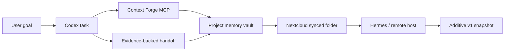

# Context Forge Case Study

## Page Title

Context Forge: Persistent Memory for AI-Assisted Project Work

## One-Line Summary

Context Forge is a practical continuity system that lets AI-assisted work resume across tasks, machines, models, and interruptions without relying on private chat history or unstated memory.

## Role Positioning

I built Context Forge as an AI operations layer: a portable, scoped, human-readable project memory that helps agents and people pick up work from evidence instead of guessing.

This is not positioned as a model breakthrough. The value is operational: continuity, handoffs, traceability, and safer collaboration across tools.

## The Problem

AI-assisted work often breaks at the exact moment it needs continuity. A project may span a local machine, a VPS, GitHub, a chat session, an SSH connection, a scheduler, a document, and a human interruption. When the next session starts, the assistant may not know what changed, what was tested, what decisions were made, or what must not be touched.

The result is familiar:
- repeated explanations
- lost implementation context
- stale assumptions
- unsafe guesses about credentials or production access
- weak handoffs between tools and sessions
- progress that depends too heavily on one chat window staying alive

## The Solution

Context Forge creates a dedicated project-memory vault that can be read by supported tools before work starts and updated after substantive work finishes.

The memory is:
- **scoped** to the project and task
- **human-readable** so the user can inspect it
- **evidence-backed** so future work can cite decisions and verification
- **portable** across local and remote systems
- **safe by design** because credentials and secret-bearing content are excluded

## Architecture



Current implementation evidence:
- Context Forge MVP is implemented.
- Codex reads the dedicated Nextcloud filesystem vault.
- Hermes can read an additive v1 snapshot through its existing `/opt/data/ContextForge` mount.
- The legacy README and journal remain unchanged while the additive snapshot provides a safer validation path.
- Context Forge supports marking a Nextcloud filesystem-synced vault as clean without pretending a WebDAV sync occurred.

## Workflow

1. A task starts.
2. The agent retrieves scoped project context.
3. Work proceeds from the latest known decisions, risks, and next actions.
4. The agent verifies changes or records observations.
5. The agent writes a structured handoff.
6. A later agent, model, or machine resumes from that handoff.

## Before / After

### Before Context Forge

A new session starts with a vague prompt like "continue the project." The agent has to ask for background, infer project state, inspect unrelated files, and may repeat work or miss safety constraints.

### After Context Forge

A new session starts by retrieving scoped context. It sees the current state, active decisions, unresolved actions, verification history, and safety boundaries. It can continue from the recorded next action instead of reconstructing the project from scratch.

## Proof Assets To Place On The Page

### Screenshot 1: Context Retrieval

Caption: "A fresh Codex task retrieves scoped Context Forge memory before making changes."

What it proves:
- The workflow is real
- Project memory is available at task start
- The system does not depend on one chat window

### Screenshot 2: Project Vault

Caption: "The Context Forge vault stores human-readable project state in a synced filesystem location."

What it proves:
- The memory is inspectable
- The design is portable
- The user is not locked into hidden model memory

### Screenshot 3: Evidence-Backed Handoff

Caption: "Each substantive work session records outcome, decisions, changed artifacts, verification, and next actions."

What it proves:
- Continuity is structured
- Future agents have accountable context
- The workflow separates evidence from assumptions

### Screenshot 4: Remote Read Path

Caption: "Hermes can read the additive v1 snapshot through the existing `/opt/data/ContextForge` mount."

What it proves:
- Context can cross from local work into remote operational environments
- The design supports machine-to-machine continuity

## Sanitized Journal Example

```text
Project: Context Forge
Outcome: Rechecked Context Forge after Hermes updates and confirmed that September 7 vault files are visible in both the remote Nextcloud data path and the local sync folder.

Decisions:
- Adopt Codex first through project-scoped MCP.
- Keep Hermes unchanged during validation.
- Use a separately named manual shadow adapter before wider remote automation.

Verification:
- Local task retrieved project context from Context Forge.
- Remote path could read the additive v1 snapshot.
- Sync status was marked clean for the filesystem-synced vault without claiming WebDAV synchronization.

Next actions:
- Open a fresh Codex task and confirm automatic MCP discovery.
- Ask Hermes to read the v1 snapshot and perform one harmless scoped task.
```

## What I Built

- A project-scoped memory pattern for AI-assisted work
- A structured handoff format
- A vault-backed continuity workflow
- A local Codex retrieval path
- A remote-readable snapshot path for Hermes validation
- Safety rules around credentials, authorization, and production changes

## What This Shows Employers

- I can turn a recurring operational problem into a working system.
- I understand that AI adoption fails when context, process, and safety are ignored.
- I can design workflows across local machines, remote servers, synced storage, and AI tools.
- I document decisions and verification so another person or agent can continue the work.
- I use AI as part of an operating process, not as a vague productivity claim.

## Outcome Statement

Context Forge turns AI project memory into an operational asset. It helps work survive interruptions, model changes, tool changes, and machine boundaries while keeping the evidence visible to humans.

## Public Page CTA

Review the proof assets, inspect the repository when public, and compare the before/after workflow. The point is not that AI remembers everything. The point is that the work has a memory system people can inspect and improve.
