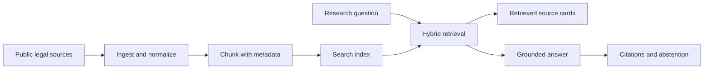

# Legal RAG Next Project

## Working Title

**Source-Grounded Legal RAG Demo**

## Portfolio Purpose

This project should prove that you can build a careful retrieval-augmented workflow against a serious source library.

The point is not to build a lawyer replacement. The point is to show:

- retrieval discipline
- citation handling
- source boundaries
- abstention when evidence is weak
- auditability
- practical AI operations around high-stakes material

## Positioning

Use this language:

**A citation-grounded legal research demo that answers only from retrieved public sources and shows its work.**

Avoid:

- "legal advice"
- "AI lawyer"
- "trained on the law"
- "guaranteed legal answers"
- broad claims about correctness

## Recommended First Scope

**FCRA source-grounded research demo**

Why:

- Concrete employment and consumer relevance
- Manageable corpus
- Federal sources are easier to cite cleanly
- Useful for operations and compliance-adjacent roles
- Less risky than appearing to offer criminal or family-law advice

## Public Source Options

- CourtListener / Free Law Project for opinions and metadata
- Caselaw Access Project for bulk historical case law
- eCFR for federal regulations
- GovInfo for official federal publications

## MVP Features

### Corpus Builder

- source name
- source URL
- date/version metadata
- title/citation
- normalized text
- stable chunk IDs

### Retriever

- keyword search
- vector search
- hybrid ranking
- source filters
- date/version filter where available

### Answer Generator

- answer only from retrieved passages
- cite every substantive claim
- include source cards
- flag uncertainty
- refuse if retrieved evidence is insufficient
- never present output as legal advice

### Audit View

- user question
- retrieved chunks
- source titles
- citations/URLs
- rank scores
- selected passages
- final answer
- abstention reason when applicable

### Evaluation Set

Create 20 test questions:

- 10 answerable from the corpus
- 5 partially answerable
- 5 unanswerable

Measure:

- correct source retrieved
- answer cites source
- unsupported question triggers abstention
- no fabricated citations

## Architecture



## Proof Assets

- GitHub repository with clean README
- Architecture diagram
- Search UI screenshot
- Cited-answer screenshot
- Audit-view screenshot
- Small evaluation table
- Source list with URLs
- Correct abstention example
- LinkedIn carousel explaining why retrieval beats closed-book citation guessing

## Suggested Repo

```text
legal-rag-source-demo
```

## Public Disclaimer

```text
This is a technical retrieval demo using public legal sources. It is not legal advice and should not be relied on for legal decisions. The demo is designed to show source grounding, citation handling, and abstention behavior.
```

## Success Standard

The demo is successful when a hiring manager can see what sources were used, how documents were chunked, what passages were retrieved, why the answer cited those passages, when the system refused to answer, and what limitations remain.
