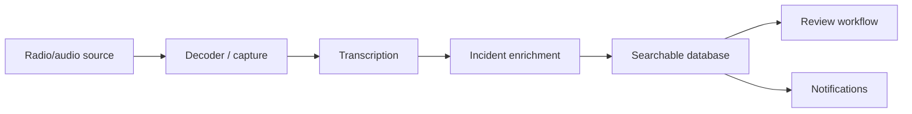
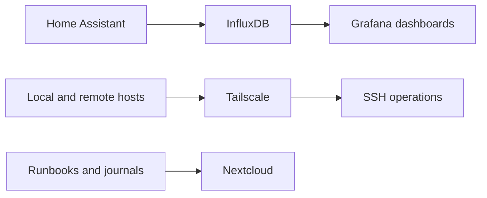

# Supporting Case Studies

## Battle Buddy: AI-Assisted Public Safety and Radio Operations

### One-Line Summary

Battle Buddy is an operational pipeline for capturing, transcribing, organizing, and reviewing public-safety radio and incident information.

### Why It Belongs In The Portfolio

Battle Buddy shows the same operating style as Context Forge in a harder environment: real-time data, imperfect inputs, remote services, transcripts, enrichment, search, and notifications.

### Problem

Public-safety radio and incident information can be fragmented, fast-moving, and hard to review after the fact. A useful system needs to capture raw signals, preserve context, make information searchable, and support quick review without pretending the data is cleaner than it is.

### System Shape

### Proof To Add

- Screenshot of sanitized transcript search
- Screenshot of an incident timeline
- Sanitized database row or query result
- Sanitized notification example
- Diagram of the pipeline
- GitHub evidence if publishable
- Short "what broke and how I fixed it" operations note

### Outcome Copy

The project demonstrates practical automation around messy operational data. It combines capture, transcription, enrichment, storage, and review into a workflow that can preserve context and make later analysis faster.

### Employer Signal

- Technical operations under real-world constraints
- Linux/VPS ownership
- Pipeline design
- API and data integration
- Incident review workflows
- Documentation and troubleshooting

## Infrastructure and Home Automation Lab

### One-Line Summary

The infrastructure lab connects local devices, remote services, monitoring, dashboards, and operational notes into a repeatable technical environment.

### Why It Belongs In The Portfolio

This case study shows day-to-day systems ownership: monitoring, remote access, recovery, documentation, and automation across a personal lab.

### Problem

Home and lab infrastructure becomes difficult to operate when dashboards, device state, logs, remote machines, and notes live in separate places. The goal is not a flashy smart-home demo. The goal is observable systems that can be maintained and recovered.

### System Shape

### Proof To Add

- Grafana dashboard screenshot
- Home Assistant dashboard screenshot
- Sanitized topology diagram
- Sanitized runbook excerpt
- Restart/recovery note
- Evidence of fresh Home Assistant writes into InfluxDB across multiple domains

### Outcome Copy

The lab shows how I approach technical operations: make the system observable, document the recovery path, verify after restarts, and keep enough context that future work does not depend on memory.

### Employer Signal

- Monitoring and observability
- Remote access discipline
- Practical automation
- Troubleshooting
- Systems documentation
- Operational ownership

## Portfolio Relationship Between The Three Projects

Context Forge is the flagship because it explains the operating philosophy. Battle Buddy proves the approach in a live data pipeline. The infrastructure lab proves the same habits in ongoing systems operations.

Together, the story is:

> I build practical systems that connect tools, preserve context, and make technical work easier to resume, inspect, and operate.
